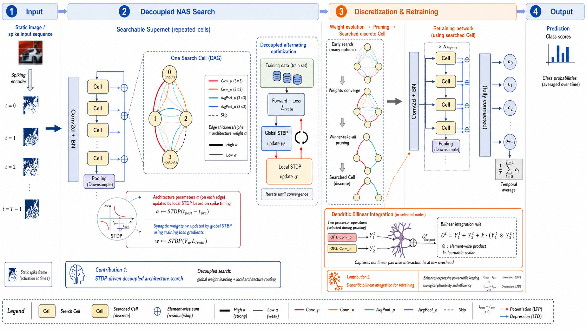

# DNASNet

**Figure:** **A.**  This figure illustrates the complete pipeline of DNASNet, spanning from input encoding and decoupled neural architecture search to the final retraining and prediction. Initially, static images or event data are encoded into spike trains across time steps and fed into a supernet composed of multiple searchable Cells. During the search phase, DNASNet fundamentally decouples the coupled bilevel optimization prevalent in traditional SNN-NAS. Specifically, it employs global Spatio-Temporal Backpropagation (STBP) to update the synaptic weights $w$ based on the training loss, while independently updating the architecture parameters $\alpha$ via Spike-Timing-Dependent Plasticity (STDP) governed by local spike timing during the validation forward pass. This explicitly avoids the prohibitive computational overhead of gradient backpropagation through architecture variables. As the search iterates, competition arises among candidate operations within the Cell; operations exhibiting stronger temporal causality acquire higher weights. Ultimately, a winner-takes-all strategy is executed to retain the operation with the highest weight, deriving a sparse and discrete Cell architecture. In the retraining phase, these searched Cells are stacked to construct the final SNN. Crucially, a biologically-inspired dendritic bilinear integration module is introduced at the selected dual-branch nodes to model the non-linear interplay between excitatory and inhibitory pathways via $O^t = Y_1^t + Y_2^t + k(Y_1^t \odot Y_2^t)$. Finally, the network temporally averages the outputs across all time steps to yield the classification prediction. Overall, this pipeline highlights the two core innovations of DNASNet: the highly efficient STDP-driven decoupled architecture search, and the dendritic bilinear integration mechanism that significantly boosts representational capacity during retraining.


**Figure:** **B.** Example of a neuron cluster containing only one excitatory neuron and one inhibitory neuron, performing a secondary integration operation on the additive behavior of the neuron cluster


**Figure:** **C.** The effect of bilinear coefficients was verified under a model with 8 Cell layers, 4 time steps, and 10M parameters, and it was found that the performance was improved on both static data sets and neuromorphic data sets. What’s interesting is that all initial values ​​of k_bilinear are set to 0.1. After training, kEE is stable around 0.2, kII is stable at 0.01fujin, and KEI is stable around 0.25.

## Requirements

To install requirements:

```setup
pip install -r requirements.txt
```

## Training

### CIFAR10

To train the models on CIFAR10 , run the following command:

```train
python NeuEvo_main_new.py --model NetworkCIFAR --dataset cifar10 --batch-size 128 --step 4 --layers 8 --arch cifar_new0
```
### DVS-CIFAR10
To train the models on DVS-CIFAR10 , run the following command:

```train
python NeuEvo_main_new.py --model NetworkCIFAR --dataset dvsc10 --batch-size 128 --step 4 --layers 8 --arch dvsc10_new1
```
### DVS-Gesture
To train the models on DVS-G , run the following command:

```train
python NeuEvo_main_new.py --model NetworkCIFAR --dataset dvsg --batch-size 128 --step 4 --layers 8 --arch dvsg_new2
```

